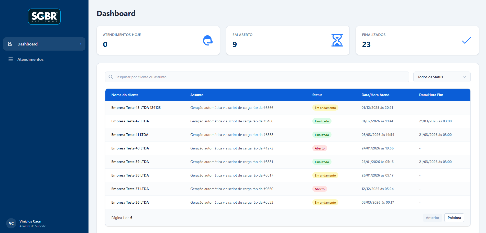

# SGBR - Desafio Técnico

<div align="center">
  
</div>

## Funcionalidades

O projeto atende aos requisitos do desafio:

- **Busca e Filtros:** Pesquisa por nome, assunto e filtro de status.
- **Atendimentos:** Interface para criação, edição, exclusão e alteração de status.
- **Persistência Local:** Os dados são mantidos no `localStorage` do navegador.
- **Paginação:** Listagem em tabela dividida em páginas.
- **Feedback Visual:** Toasts e modais para ações.
- **Loading:** Carregamento spinners.

---

## Como Executar Localmente

1. Clone o repositório:

```bash
git clone https://github.com/CaonVini/teste-tecnico-sgbr.git
```

2. Acesse a pasta da aplicação:

```bash
cd teste-tecnico-sgbr
```

3. Instale as dependências:

```bash
npm install
```

4. Inicie o servidor de desenvolvimento:

```bash
npm run dev
```

5. Acesse o projeto no navegador, geralmente em `http://localhost:5173`.

---

## Tecnologias e Decisões Técnicas

- **Vue 3 (Composition API):** Interface construída favorecendo código focado com `<script setup>`.
- **TypeScript:** Utilizado para tipagem e validação de dados nas tabelas e forms.
- **Tailwind CSS:** Para estilização baseada em utilitários e sistema de design limpo do zero.
- **Gerenciamento de Estado Customizado:** A manipulação dos dados e a lógica da persistência foram isoladas em _composables_ (`useAtendimentos.ts` por exemplo). Isso separa a regra de negócio da UI, facilitando futuras integrações com APIs reais sem quebrar a tela.

---

## 📁 Estrutura de Pastas

```text
src/
 ├── components/         # Blocos visuais reaproveitáveis
 │   ├── layout/         # Containers estruturais (Menus, Base da página)
 │   ├── pages/          # Páginas raízes visualizáveis
 │   └── ui/             # Micro-componentes (Botões, Inputs, UI elementar)
 ├── composables/        # Regras de negócio e Hooks ("Store" local)
 ├── types/              # Padronização TypeScript
 ├── App.vue             # Componente raiz da aplicação
 └── main.ts             # Ponto de entrada do Vue
```

---

Desenvolvido por **Vinicius Caon**.
